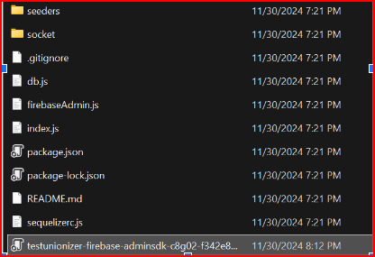

## **Backend (Node.js)**

This is the backend service called by our client to create and access all tables and rows. This is one of the repos that must be run for the app to properly work.
---
### **How to run:**
1. **Node.js Installed**: Ensure you have Node.js installed, and `npm` commands are runnable in your terminal.
2. **Code Editor**: Visual Studio Code is recommended, but any editor will work.

#### **Setup Instructions**
1. Open up a terminal and make sure you are in folder called server

2. Set up Firebase Authentication:
    1. create a Firebase Project
        1. Go to [text](https://firebase.google.com/)
        1. click Go to Console > Create a Project
        1. Follow the instructions and use default settings
    2. Once the project is ready we want to activate user authentication 
        1. on the sidebase under "Build" click on Authentication
        1. click on get started
        1. under sign-in method tab click on "Email/Password"
            1. enable Email/Password
            1. email link will stay disabled 
            1. click save
    3. Now that authentication is enabled we need to make it so we have firebase-sdk set for our server folder. To do this we need a service-account.json file
        1. in the console click on the gear sign next to “Project Overview” located on the side bar. Click on “Project Settings”
        1. navigate to “Service accounts”
        1. scroll down and click on Generate new private key
            1. It will give you a warning telling you to keep the private key PRIVATE. It should be added to the gitignore if it is not already there (it should already be there)
            1. click generate key
            1. This will download the key for the service account which we will rename and place in our project directory
                1. locate the file in your local downloads directory   
                1. either move the file or copy its contents to the cloned repository folder
                1. 
                1. We will rename the file to match the name in the .gitignore
                1. rename the file serviceAccountKey.json 
                1. it should end up looking something like this…
                1. 
                1. That is it for setting up firebase FOR THE BACKEND… There is more to do for the frontend 
        1. After setting up the firebase navigate to the cloned repository folder. Run the following command:
        1. ```bash
        npm i
        ```
        this will install all the packages and dependencies required for the project
        1. Before setting up environment variables, we need to make sure our database is up and running. We need to install postgresql. If you already have postgresSQL installed on your device you may skip this step.
            1. Go to [text](https://www.postgresql.org/download/) and install postgres for your operating system
                1. I have a windows so I’ll click on windows and then on “download the installer”
                1. 
                1. download the latest version for your specific device architecture
                    1. I have a windows x-86-64 so i install the installer for my architecture
                1. go through the installation process 


